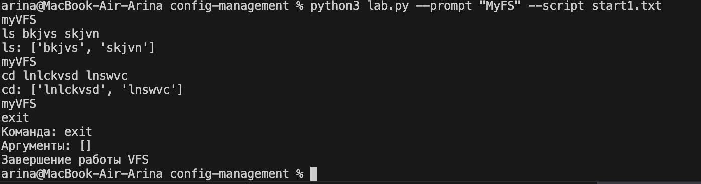

Config Management Project - Python VFS REPL

Общее описание класса VFSRepl
VFSRepl (Virtual File System REPL) - это интерактивная командная оболочка для эмуляции работы с виртуальной файловой системой. Класс реализует базовый REPL (Read-Eval-Print Loop) интерфейс, позволяющий пользователю выполнять команды для навигации и управления виртуальной файловой системой
минимальный прототип. Большинство функций в нем пока
представляют собой заглушки, но диалог с пользователем уже поддерживается.

1. Конструктор __init__()
Назначение: Инициализация объекта VFSRepl
Параметры: vfs_name (str, по умолчанию "myVFS") - имя виртуальной файловой системы
Инициализируемые атрибуты:
self.vfs_name - сохраняет имя VFS
self.current_dir - текущая рабочая директория (инициализируется как "/")
self.running - флаг состояния работы программы (True - работает, False - завершена)

2. Метод print_prompt()
Назначение: Вывод приглашения командной строки
Функционал: Отображает имя виртуальной файловой системы как приглашение для ввода команд

3. Метод parse_input()
Назначение: Парсинг пользовательского ввода
Параметры:
user_input (str) - строка ввода от пользователя
Возвращает:
command (str или None) - извлеченная команда
args (list) - список аргументов команды
Функционал:
Удаляет лишние пробелы в начале и конце строки
Разбивает строку на части по пробелам
Первое слово - команда, остальные - аргументы
Возвращает (None, []) для пустого ввода

4. Команда cmd_ls(), cmd_cd(), cmd_exit() 
Назначение: Обработка команды ls, cd, exit (list directory contents)
Параметры:
args (list) - аргументы команды
Текущая реализация: Выводит аргументы команды (заглушка)

5. Метод handle_command()
Назначение: Маршрутизатор команд
Параметры:
command (str) - имя команды
args (list) - аргументы команды
Функционал:
Определяет какую функцию вызвать в зависимости от команды
Обрабатывает неизвестные команды выводом сообщения об ошибке

6. Основной метод run()
Назначение: Главный цикл выполнения программы
Функционал:
Бесконечный цикл while, работающий пока self.running = True
Отображает приглашение командной строки
Читает пользовательский ввод
Парсит ввод на команду и аргументы
Обрабатывает команду
Перехватывает исключения для обеспечения непрерывной работы

7. Функция main()
Назначение: Точка входа в программу
Функционал:
Создает экземпляр VFSRepl с именем "myVFS"
Запускает основной цикл выполнения

