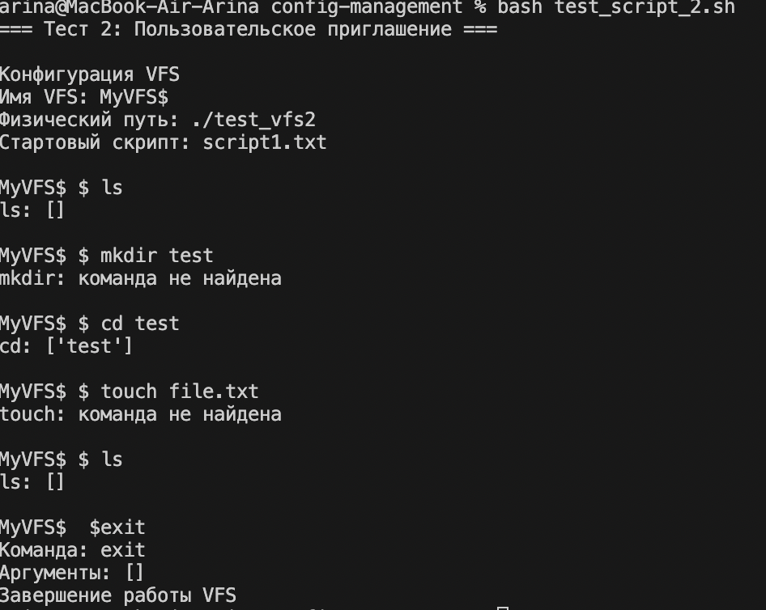
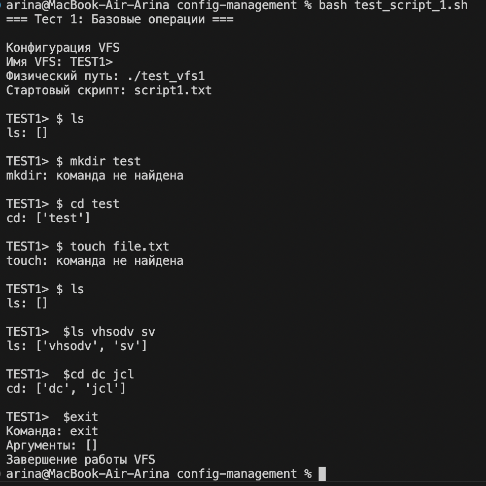

1. Общее описание (обновленное)
VFSRepl теперь поддерживает настраиваемые параметры запуска через командную строку. Добавлена возможность выполнения стартовых скриптов и расширенная конфигурация системы.

Новые возможности второго этапа:
    Параметризированный запуск через аргументы командной строки
    Поддержка выполнения стартовых скриптов перед интерактивным режимом
    Расширенный отладочный вывод конфигурации при запуске
    Обработка комментариев в скриптах (строки, начинающиеся с #)

2. Описание всех функций и настроек (обновленное)

Обновленный класс VFSRepl
    Конструктор __init__(self, vfs_name="myVFS", path=None, start_script=None):
        vfs_name - пользовательское приглашение к вводу
        path - путь к физическому расположению VFS
        start_script - путь к стартовому скрипту

Добавлен отладочный вывод всех параметров при запуске

Новые и обновленные методы:
    run_start_script(self) - выполняет стартовый скрипт:
        Проверяет наличие указанного скрипта
        Читает и выполняет команды из файла построчно
        Имитирует интерактивный ввод с выводом приглашения
        Обрабатывает ошибки с продолжением выполнения скрипта

    parse_input(self, user_input) - улучшенный парсер:
        Добавлена поддержка комментариев (строки, начинающиеся с # игнорируются)

    Новая функция parse_args()
        Реализует парсинг аргументов командной строки с помощью модуля argparse:
            Поддерживаемые аргументы:
            --path - путь к физическому расположению VFS (по умолчанию: текущая директория)
            --prompt - пользовательское приглашение к вводу (по умолчанию: 'myVFS')
            --script - путь к стартовому скрипту (опционально)

    Обновленная функция main()
        Использует парсинг аргументов командной строки
        Передает полученные параметры в конструктор VFSRepl

3. Описание команд для сборки проекта и запуска тестов
Запуск с различными параметрами
    Базовый запуск (со значениями по умолчанию):
        python vfs_repl.py
    Запуск с пользовательским путем:
        python vfs_repl.py --path /home/user/vfs_storage
    Запуск с пользовательским приглашением:
        python vfs_repl.py --prompt "MyCustomVFS"
    Запуск со стартовым скриптом:
        python vfs_repl.py --script startup.txt
    Комбинированный запуск:
        python vfs_repl.py --path /custom/path --prompt "TestVFS" --script init_commands.txt

Примеры тестовых скриптов
Скрипт 1: test_script1.txt
    text
    # Тестовый скрипт для VFS
    ls -l -a
    cd /home/user
    ls
    exit
Скрипт 2: test_script2.txt
    text
    # Скрипт с ошибками для тестирования обработки
    ls
    unknown_command  # Эта команда вызовет ошибку
    cd /test
    ls -la
Скрипт 3: complex_test.txt
    text
    # Комплексный тест
    ls
    cd /var/log
    ls -l
    cd ..
    pwd  # Неизвестная команда
    ls
    exit

Создание и запуск тестовых скриптов
    Создание скрипта:
        echo -e "ls -l\ncd /home\nls\nexit" > test_script.txt
    Запуск с тестовым скриптом:
        python vfs_repl.py --script test_script.txt --prompt "TestVFS"

4. Примеры использования 

Пример 4: Интерактивный режим после скрипта
Если скрипт не содержит команду exit, программа перейдет в интерактивный режим после выполнения скрипта.

