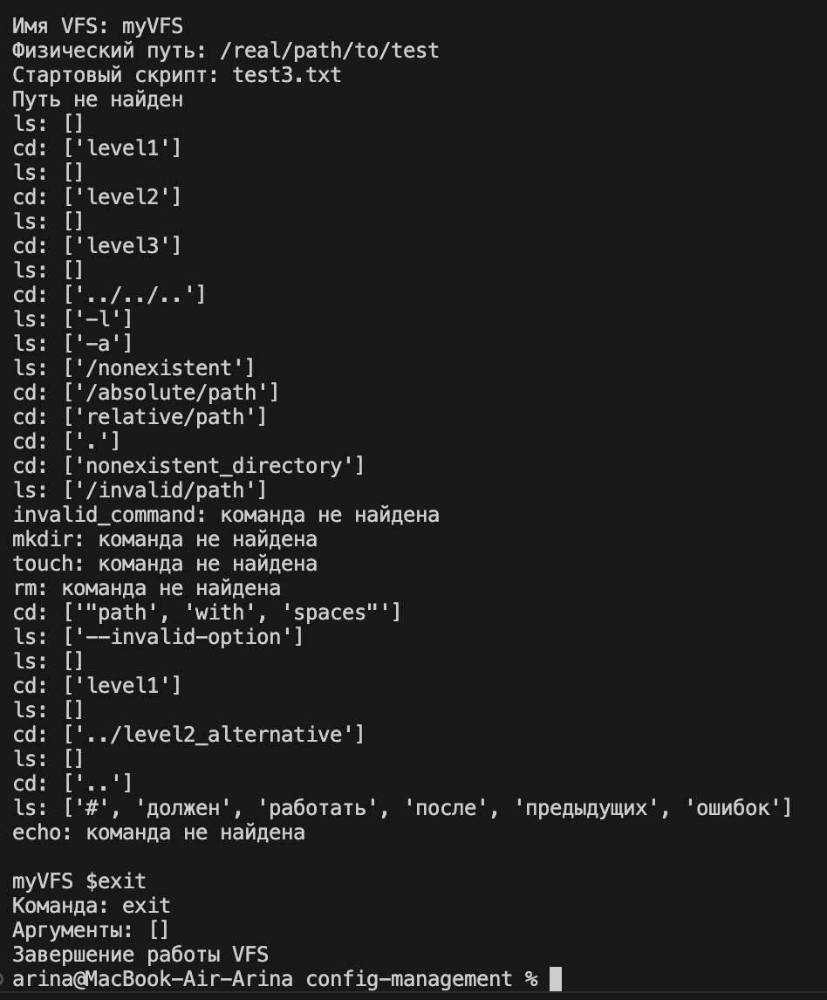

Общее описание обновленного класса VFSRepl
VFSRepl (Virtual File System REPL) - это расширенная интерактивная командная оболочка для эмуляции работы с виртуальной файловой системой. Новые возможности включают поддержку аргументов командной строки, выполнение стартовых скриптов и улучшенную обработку ввода.
подключить виртуальную файловую систему (VFS).

1. Класс VFSNode
Новые параметры:
name (str) - имя узла (файла или директории)
is_directory (bool) - флаг, указывающий является ли узел директорией
parent (VFSNode) - ссылка на родительский узел

Новые методы:
__init__() - инициализация узла VFS
add_child() - добавление дочернего узла
get_path() - получение полного пути к узлу в VFS

2. Класс VFS  
Новые параметры:
root (VFSNode) - корневой узел файловой системы
loaded (bool) - флаг загрузки VFS с диска

Новые методы:
__init__() - инициализация VFS
load_from_disk() - загрузка структуры файловой системы с физического диска
_build_vfs_tree() - внутренний метод для рекурсивного построения дерева VFS

3. Обновленный конструктор VFSRepl.__init__()
Новый функционал:
Инициализация объекта VFS для работы с файловой системой
Автоматическая загрузка VFS из указанного пути при создании

4. Обновленный метод run_start_script()
Новый функционал:  
Проверка существования файла скрипта перед выполнением
Обработка ошибок выполнения скрипта с выводом сообщений

