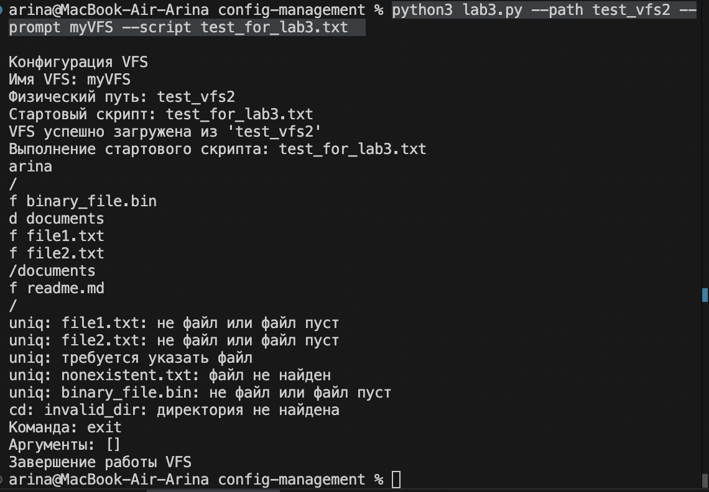

Цель: поддержать команды, имитирующие работу в UNIX-подобной
командной строке.

Реализованные команды:

ls - показывает содержимое текущей директории

cd - смена директории (поддерживает .., /, и относительные пути)

pwd - показывает текущий путь в VFS

uniq - выводит уникальные строки из текстового файла

whoami - показывает текущего пользователя системы

Особенности реализации:

Обработка ошибок для всех команд

Поддержка относительных и абсолютных путей

Правильная работа с иерархией директорий

Загрузка содержимого файлов с диска для команды uniq

Стартовый скрипт демонстрирует все команды и обработку ошибок

