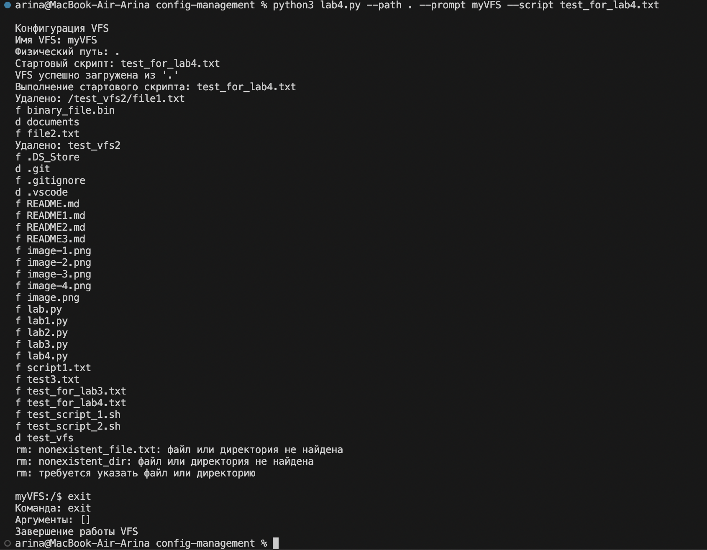

Цель: поддержать более сложные команды, изменяющие состояние VFS, при
этом модификации должны осуществляться только в памяти.

1. Улучшенная команда ls
Теперь поддерживает аргументы (пути к файлам/директориям)

Может показывать содержимое указанных директорий

Показывает отдельные файлы, если они указаны напрямую

Сообщает об ошибках, если файл/директория не найдены

2. Команда rm для удаления файлов и директорий
Поддерживает флаг -r/-R для рекурсивного удаления директорий

Проверяет тип объекта перед удалением (файл vs директория)

Рекурсивно удаляет все содержимое директорий

Выводит информационные сообщения об успешном удалении или ошибках

3. Метод find_node в классе VFS
Умеет находить узлы по относительным и абсолютным путям

Поддерживает специальные пути: . (текущая директория), .. (родительская)

Обрабатывает сложные пути с несколькими уровнями вложенности

Возвращает None, если путь не найден

4. Метод remove_child в классе VFSNode
Удаляет дочерний узел по имени

Возвращает булево значение, указывающее на успешность операции

Упрощает управление иерархией узлов

5. Метод remove_directory в классе VFSRepl
Рекурсивно удаляет все содержимое директории

Обрабатывает вложенные директории и файлы

Возвращает статус успешности операции

6. Улучшенная обработка аргументов команд
Команда ls теперь принимает аргументы

Команда rm анализирует флаги и целевые объекты

Более гибкая система обработки параметров команд

